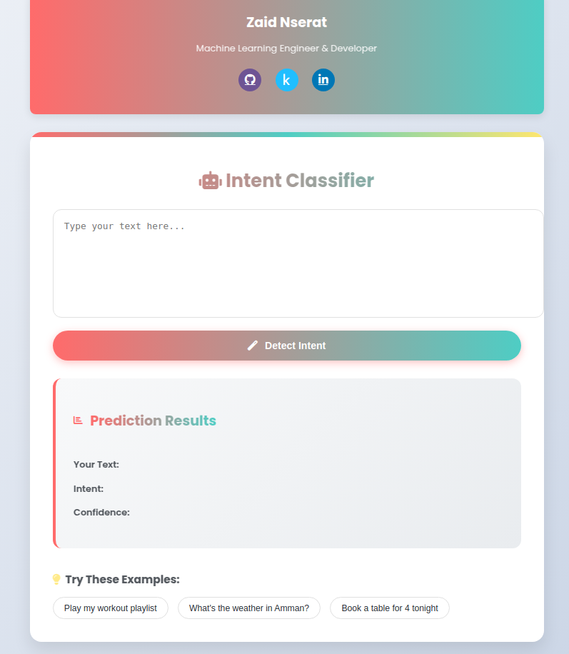

# Intent Detection API



## Overview
This project provides an intent detection model that classifies user inputs into predefined intent categories with **99% accuracy**. The API is built using Flask, making it easy to integrate into various applications.

## Features
- High-accuracy intent classification
- API-based architecture for seamless integration
- Lightweight and efficient deployment using Docker

## Installation

### 1. Clone the Repository
```sh
git clone https://github.com/your-username/intent_detection_transformer.git
cd intent_detection_transformer
```

### 2. Install Dependencies
```sh
pip install -r requirements.txt
```

### 3. Run the Application
```sh
python app.py
```

The API will be available at `http://127.0.0.1:8000`.

## API Endpoints

### 1. Home Route
**GET /**
- Returns the homepage.

### 2. Predict Intent
**POST /predict**
- **Input:** `text` (string)
- **Output:**
  ```json
  {
    "text": "example text",
    "intent": "Play Music",
    "confidence": 0.99
  }
  ```

## Docker Deployment

### 1. Build the Docker Image
```sh
docker build -t intent_detection .
```

### 2. Run the Docker Container
```sh
docker run -d -p 8000:8000 intent_detection
```

### 3. Pull the Prebuilt Docker Image
Instead of building the image locally, you can pull it directly from Docker Hub:
```sh
docker pull zaidtech/intent_detection_transformer
```

### 4. Run the Pulled Image
```sh
docker run -d -p 8000:8000 --name <name container> name image
```

The API will now be available at `http://localhost:8000`.


